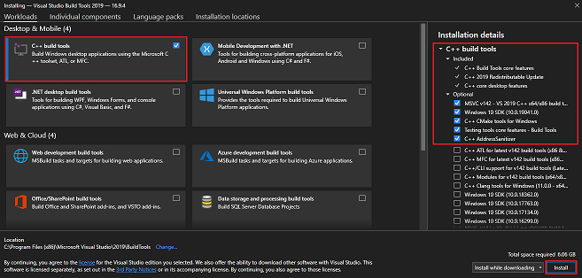

# 01-start-rust

## 개요
https://docs.microsoft.com/ko-kr/learn/modules/rust-get-started/
에서 배운 내용을 정리한 문서.

## 설치
https://rustup.rs/
에서 운영체제에 맞게 설치한다.

이전에 rustup를 설치한 경우에는 명령 rustup update를 실행하여 최신 안정화 버전의 Rust를 업데이트할 수 있습니다.

Rust에는 Visual Studio 2013 이상용 Microsoft C++ 빌드 도구가 필요합니다. Rust를 설치하려면 이러한 빌드 도구를 설치해야 합니다.

설치한 빌드 도구가 없으면 다음 단계를 수행합니다.

1. Microsoft Visual Studio 다운로드 페이지로 이동합니다.

2. 빌드 도구 다운로드 를 선택합니다.

3. 다운로드가 완료되면 설치 관리자 파일을 실행합니다. Visual Studio 설치 관리자 창이 열립니다.

4. 팝업 대화 상자에서 예 를 선택합니다. 다음 팝업 대화 상자에서 계속 을 선택합니다.

5. 설치 관리자 창의 데스크톱 및 모바일 에서 왼쪽에 있는 C++ 빌드 도구 옵션의 확인란을 선택합니다.

6. 오른쪽의 설치 세부 정보 창에서 다음 옵션이 선택되었는지 확인합니다.
  

7. 오른쪽 아래에서 설치를 선택합니다.

### 설치 확인

```
rustc --version
```

```
cargo --version
```


## Hello World 연습

```
mkdir ~/rust-learning-path
cd ~/rust-learning-path
mkdir hello-world
cd hello-world
touch main.rs
```

### main.rs 편집
```rust
fn main() {
    println!("Hello, world!");
}
```

### 컴파일 및 실행
```bash
rustc main.rs
./main
```

## Cargo
rustc 컴파일러는 간단한 프로그램에 적합하지만 거의 모든 프로젝트에서 Rust 컴파일러를 직접 사용하지 않습니다. 대신 Rust의 빌드 도구와 종속성 관리자 Cargo를 사용합니다.

좋은 점은 rustup를 설치하면 Cargo의 안정적인 최신 버전도 얻을 수 있다는 점입니다.

Cargo는 다음을 비롯한 많은 작업을 수행합니다.

1. cargo new 명령을 사용하여 새 프로젝트 템플릿을 만듭니다.
2. cargo build 명령을 사용하여 프로젝트를 빌드합니다.
3. cargo run 명령을 사용하여 프로젝트를 빌드하고 실행합니다.
4. cargo test 명령을 사용하여 프로젝트를 테스트합니다.
5. cargo check 명령을 사용하여 프로젝트 유형을 확인합니다.
6. cargo doc 명령을 사용하여 프로젝트에 대한 설명서를 작성합니다.
7. cargo publish 명령을 사용하여 crates.io에 라이브러리를 게시합니다.

## Hello World - Cargo

```bash
cargo new hello-cargo
```

```bash
cd hello-cargo
cargo run
```