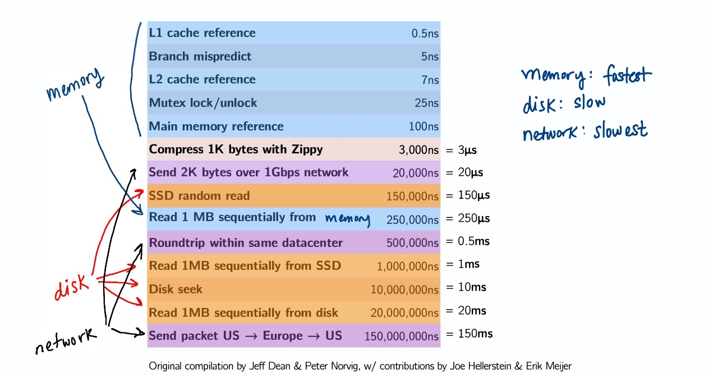
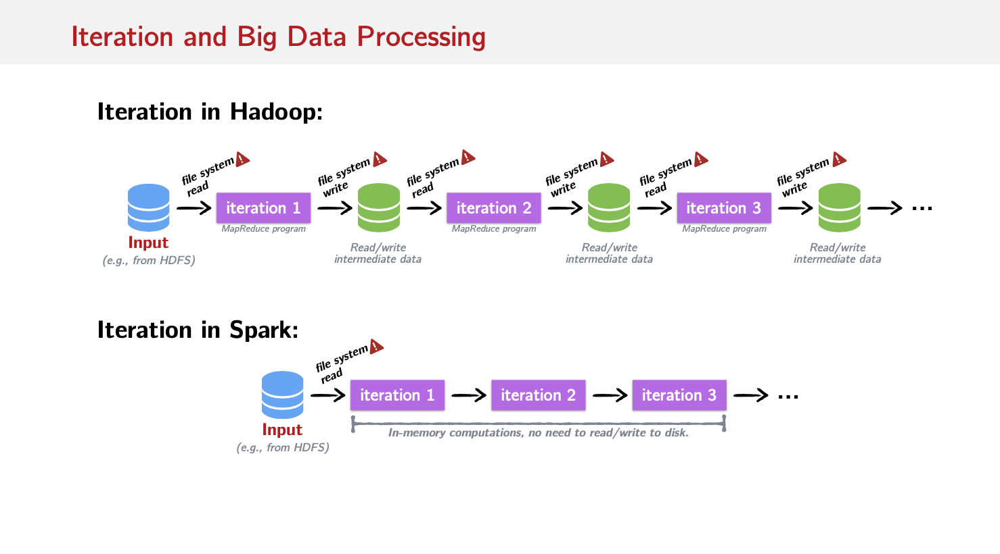
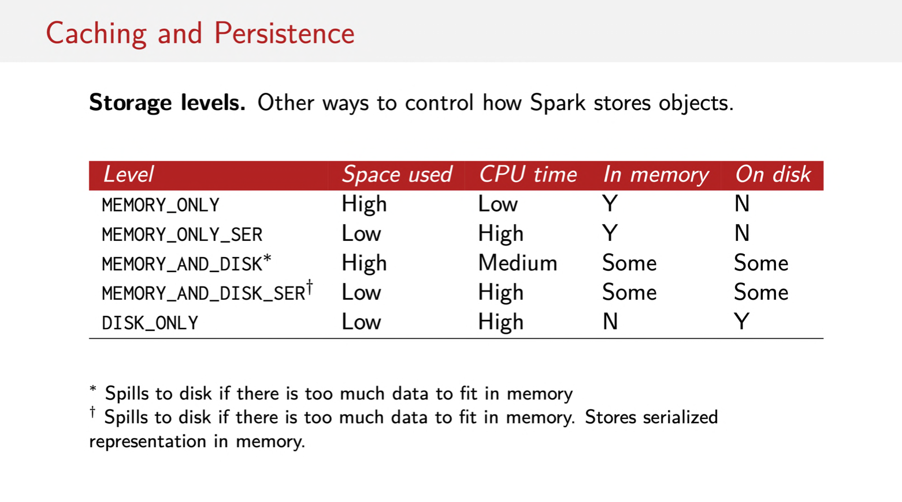
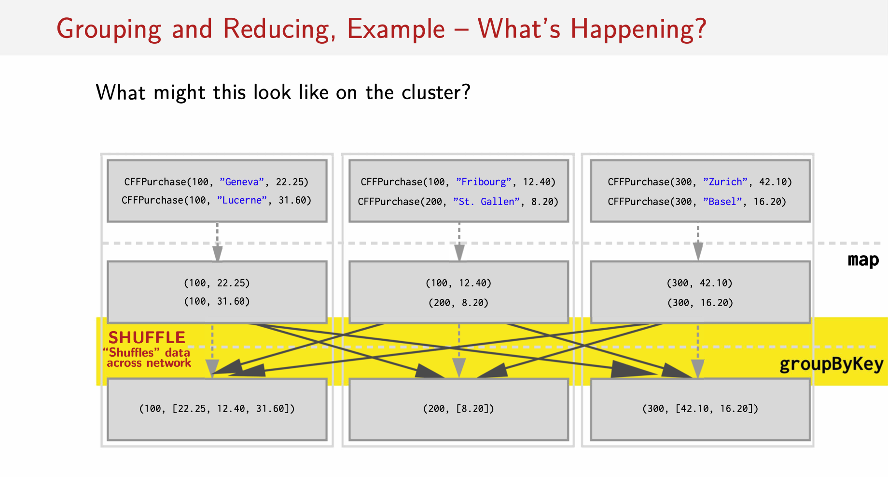
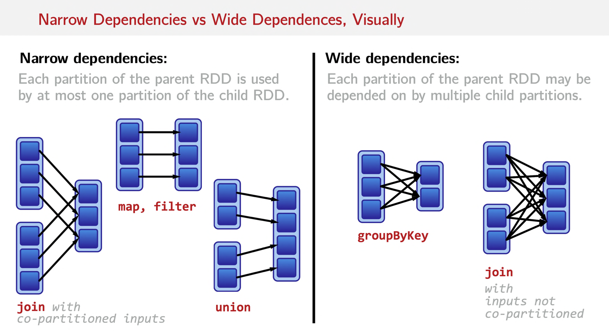
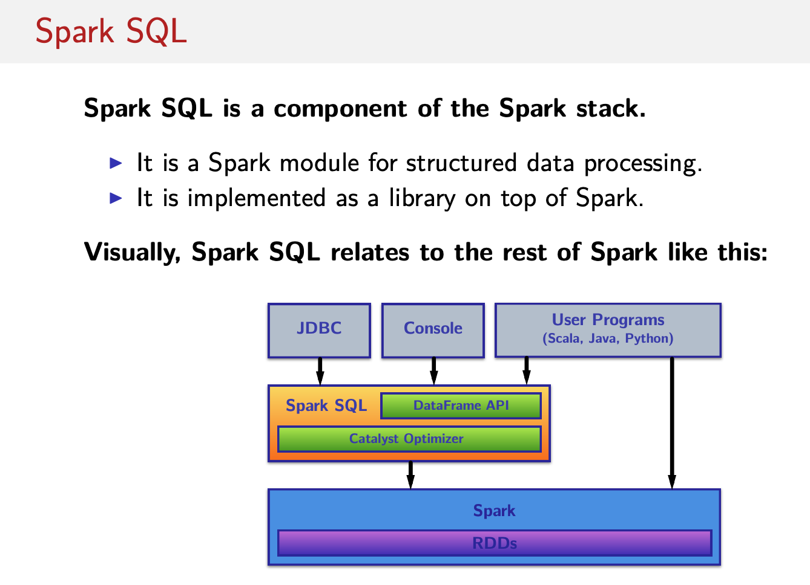

# Week1
## Why Scala? Why spark?
스칼라로 구현된 Spark는 leveraging 함으로서 scale up 하기 쉽게 해준다.
Spark는 large-scale data processing framework이다.

Hadoop도 좋은 선택이다.
Spark는
- more expressive 하다. flatMap filter등 다양한 collection 함수를 쓸 수 있다.
- Performant 하다.
- Good for data science. iteration을 가능하게 해준다. Hadoop은 이를 구현하기 힘들다.


Distributed data parallelism은 Shared Memory data parallelism과 다르다.

Shared Memory
- Split the data
- Workkers/threads independently operate on the data shards in parallel.
- Combine when done (if necessary)

Distributed
- Split the data **over several nodes.**
- Nodes independently operate on the data shards in parallel.
- Combine when done (if necessary)

하지만 network latency between workers를 걱정해야 한다.
Distributed data parallelism을 사용함으로서 collections abstraction을 유지할 수 있다.

Apache Spark는 distributed data-parallel programming을 위한 framework이다.
Spark는 Resilient Distributed Datasets(RDDs)라고 불리는 distributed data parallel model을 implelments한다.

이전에 배웠던 parallel들은 1 machine 내에서 single multicore / multi-processor를 이용한 Data parallelism이었다.
이제는 이를 Multiple machine으로 확장한다.

이로 인해 고려해야 할 사항들이 있다.
- Partial Failure
- Latency
Spark는 이 2가지 이슈를 잘 해결해준다.




Spark는 fault-tolerance와 handling latency를 functional programming 방식으로 해결한다.

Idea: Keep all data immutable and in-memory. All operations on data are just functional transformations, like regular Scala collections. Fault tolerance is achieved by replaying functional transformations over original dataset.
Result: Spark has been shown to be l00x more performant than Hadoop, while adding even more expressive APls.


RDD는 immutable sequential 혹은 parallel Scala collections와 유사하다.
다음과 같은 Combinators를 제공한다.
- map
- flatMap
- filter
- reduce
- fold
- aggregate

RDD 를 만드는 방법은 두 가지가 있다.
1. Transforming an existing RDD
2. From a SparkContext (or SparkSession) object.


Scala의 collections에는 transformer와 accessors가 있다.

Transformer: Return new collections as results
e.g. map, filter, flatMap, groupBy
```scala
map(f: A => B): Traversable[B]
```

Accessor: Return single values as results
e.g. reduce, fold, aggregate.
```scala
reduce(op: (A, A) => A): A
```

이와 유사하게 Spark에서는 RDD에 transformation과 actions를 정의한다.
Transformations는 lazy하고 actions는 eager하다는 것을 반드시 기억해야 한다.

Transformations: Return new *RDDs* as results.
> They are lazy, their result RDD is not immediately computed.

Actions: Compute a result based on an RDD, and either returned or saved to an external storage system (e.g. HDFS).
> They are eager, their result is immediately computed.


이게 중요한 이유는 다음과 같다.
> Laziness/eagerness is how we can limit network communication using the programming model.


아래의 예를 살펴보자
여기에서 sc는 SparkContext를 의미한다.
```scala
val largelist: List[String] = ...
val wordsRdd = sc.parallelize(largelist)
val lengthsRdd = wordsRdd.map(_.length)
val totalChars = lengthsRdd.reduce(_ + _)
```
1,2,3번 째 줄의 코드까지 실행했을 때 cluster에는 어떤 변화가 일어날까?
`답은 아무일도 일어나지 않는다` 이다.
왜냐하면 이 것들은 모두 transfomrations이기 때문이다.
4번째 줄의 코드에 가서야 actions가 있기에 평가된다.


## Common Transformations in the Wild
아래에 있는 함수들은 모두 RDD를 리턴하므로 transformation이다.
= Lazy하다!!

- map: `map[B](f: A => B): RDD[B]`
- flatMap: `flatMap[B](f: A => TraversableOnce[B]): RDD[B]`
- filter: `filter(pred: A => Boolean): RDD[A]`
- distinct: `distinct(): RDD[B]` , 중복이 제거된 RDD를 리턴한다.


## Common Actions in the Wild
리턴 타입이 RDD 혹은 action이다.
= Eager하다!!

- collect: `collect(): Array[T]`, RDD의 모든 elements를 리턴한다.
- count: `count(): Long`, RDD의 elements 개수를 리턴한다.
- take: `take(num: Int): Array[T]`, RDD 중 첫 번째부터 num 까지의  elements를 리턴한다.
- reduce: `reduce(op: (A, A) => A): A` , RDD의 elements들을 op 함수로 combine하고 그 결과를 리턴한다.
- foreach: `foreach(f: T => Unit): Unit`, RDD의 각 element에 function을 적용한다.


RDD[String]으로 이루어진 gigabytes의 log가 있다고 가정하다.
그렇담 2016년 12월에 발생한 ERROR 로그의 개수는 어떻게 카운트 할까?
```scala
val lastYearslogs: RDD[String] = ...
val numDecErrorlogs = lastYearslogs.filter(lg=> lg.contains("2016-12") && lg.contains("error"))
  .count()
```

이런 Laziness로 인해 얻을 수 있는 장점이 있다.

```scala
val lastYearslogs: RDD[String] = ...
val firstlogsWithErrors = lastYearslogs.filter(_.contains("ERROR"))
  .take(10)
```
위와 같이 10개만 취하려 할때 모든 데이터를 순회할 필요 없이 10개를 얻는 순간 종료를 할 수 있다.

## Transformations on Two RDDs
RDDs also support set-like operations, like union and intersection.
Two-RDD transformations combine two RDDs are combined into one.

리턴타입이 항상 RDD 이므로 Lazy하다!

- union: `union(other: RDD[T]): RDD[T]`
- intersection: `intersection(other: RDD[T]): RDD[T]`
- subtract: `subtract(other: RDD[T]): RDD[T]`
- cartesian: `cartesian[U](other: RDD[U]): RDD[(T, U)]` / 다른 RDD와의 Cartesian product 를 리턴한다

## Other Useful ROD Actions
Scala collections에는 존재하지 않는 Spark에만 존재하는 분산 처리에 장점이 있는 actions도 있다
아래의 함수들은 반환타입이 RDD가 아니기때문에 actions이다. = Eager하다.

- takeSample: `takeSample(withRepl: Boolean, num: Int): Array[T]` / Return an array with a random sample of num elements of the dataset, with or without replacement.
- takeOrdered: `takeOrdered(num: Int)(implicit ord: Ordering[T]): Array[T]` / Return the first n elements of the ROD using either their natural order or a custom comparator.
- saveAsTextFile: `saveAsTextFile(path: String): Unit` / Write the elements of the dataset as a text file in the local filesystem or HDFS.
- saveAsSequenceFile: `saveAsSequenceFile(path: String): Unit` / Write the elements of the dataset as a Hadoop Se­quenceFile in the local filesystem or HDFS.

## Why is Spark Good for Data Science?

대부분의 data science probles는 iteration을 포함한다.



위 그림에서 위쪽은 Hadoop, 아래쪽은 Spark이다.
보면 알 수 있듯이 Iteration이 일어날때마다 Hadoop은 IO 타임이 증가하는 반면 Spark에서는 memory computation으로써 IO time을 줄였다.

## Iteration, Example: Logistic Regression
Logistic regression은 classification을 위한 iterative algorithm이다.
다른 classification algorithms와 같이 classifier's weights는 training dataset에 기반하여 반복적으로 업데이트 된다.

```scala
val points = sc.textFile(...).map(parsePoint)
var w = Vector.zeros(d)
for (i <- 1 to numIterations) {
  val gradients = points.map { p =>
    (1 / (1 + exp(-p.y * w.dot(p.x))) - 1) * p.y * p.y
  }.reduce(_ + _)
  w = -= alpha * gradient
}
```


RDD는 기본저긍로 action을 run할 때마다 recomputed 된다.
이는 data가 많아질수록 expensive 해진다.
>Spark는 memory에 캐시를 컨트롤 할 수 있도록 지원해준다.
RDD를 메모리에 캐시하기 위해선 `persist()` 혹은 `cache()`를 사용하면 된다.

```scala
val lastYearsLogs: RDDEString] = ...
val logsWithErrors = lastYearsLogs.filter(_.contains("ERROR"))
  .persist()
val firstLogsWithErrors = logsWithErrors.take(10)
val numErrors = logsWithErrors.count()
```
만약 logsWithErrors에 persist를 추가하지 않았더라면(캐싱하지 않았더라면)
firstLogsWithErrors를 계산할 때와 numErrors를 계산할 때 총 2번 계산 했어야 할 것이다.
하지만 캐싱을 했기 때문에 한 번의 logsWithErrors 계산이 이루어진다.


이를 위에 Logsitic Regression쪽에 적용하려면 points 선언 마지막에 .persist()를 추가해주면 된다.

데이터를 persist하는 방법은 여러 가지가 있다.
► in memory as regular Java objects
► on disk as regular Java objects
► in memory as serialized Java objects (more compact)
► on disk as serialized Java objects (more compact)
► both in memory and on disk (spill over to disk to avoid re-computation)

cache()
Shorthand for using the default storage level, which is in memory only as regular Java objects.

persist()
Persistence can be customized with this method. Pass the storage level you’d like as a parameter to persist.




> Key takeway:
Despite similar-looking API to Scala Collections, the deferred semantics of Spark's RDDs are very unlike Scala Collections.

One of the most common performance bottlenecks of newcomers to Spark arises from unknowingly reevaluating several transformations when caching could be used.

Spark는 Lazy를 발견하면 어떻게 하면 optimization할 수 있을지 analyze한다.

## Excerciese

```scala
object WikipediaRanking extends WikipediaRankingInterface {

  val langs = List(
    "JavaScript", "Java", "PHP", "Python", "C#", "C++", "Ruby", "CSS",
    "Objective-C", "Perl", "Scala", "Haskell", "MATLAB", "Clojure", "Groovy")

  // true로 값을 설정한다는 것은 local로 만든다는 것이다.
  // appName을 설정한 것은 SparkContext를 만들기 위함이다.
  val conf: SparkConf = new SparkConf(true).setAppName("myApp")

  // local[2]로 만든 것은 처음에 sc를 만드는 과정에서 오류가 발생했고 이를 해결하기 위해 stackoverflow에서 찾은 방법이다.
  // new SparkContext(conf)로 했더니 오류가 발생했다.
  val sc: SparkContext = new SparkContext("local[2]", "myApp", conf)

  // Hint: use a combination of `sc.parallelize`, `WikipediaData.lines` and `WikipediaData.parse`
  val wikiRdd: RDD[WikipediaArticle] = sc.parallelize(WikipediaData.lines.map(line => WikipediaData.parse(line)))

  /** Returns the number of articles on which the language `lang` occurs.
   *  Hint1: consider using method `aggregate` on RDD[T].
   *  Hint2: consider using method `mentionsLanguage` on `WikipediaArticle`
   */
  def occurrencesOfLang(lang: String, rdd: RDD[WikipediaArticle]): Int =
    rdd
      .aggregate(0)((b: Int,a: WikipediaArticle) => if (WikipediaArticle(a.title, a.text).mentionsLanguage(lang)) b + 1 else b ,
        (b, a) => b + a)

  /* (1) Use `occurrencesOfLang` to compute the ranking of the languages
   *     (`val langs`) by determining the number of Wikipedia articles that
   *     mention each language at least once. Don't forget to sort the
   *     languages by their occurrence, in decreasing order!
   *
   *   Note: this operation is long-running. It can potentially run for
   *   several seconds.
   */
  def rankLangs(langs: List[String], rdd: RDD[WikipediaArticle]): List[(String, Int)] =
    langs.map(lang => (lang, occurrencesOfLang(lang, rdd))).sortWith(_._2 >_._2)

  /* Compute an inverted index of the set of articles, mapping each language
   * to the Wikipedia pages in which it occurs.
   */
  def makeIndex(langs: List[String], rdd: RDD[WikipediaArticle]): RDD[(String, Iterable[WikipediaArticle])] =
    rdd.flatMap(rd => langs.filter(lang => rd.mentionsLanguage(lang)).map(lang => (lang, rd))).groupByKey()

  /* (2) Compute the language ranking again, but now using the inverted index. Can you notice
   *     a performance improvement?
   *
   *   Note: this operation is long-running. It can potentially run for
   *   several seconds.
   */
  def rankLangsUsingIndex(index: RDD[(String, Iterable[WikipediaArticle])]): List[(String, Int)] = {
    index.mapValues(d => d.size)
      .collect()
      .sortWith((before, after) => before._2 > after._2)
      .toList
  }

  /* (3) Use `reduceByKey` so that the computation of the index and the ranking are combined.
   *     Can you notice an improvement in performance compared to measuring *both* the computation of the index
   *     and the computation of the ranking? If so, can you think of a reason?
   *
   *   Note: this operation is long-running. It can potentially run for
   *   several seconds.
   */
  def rankLangsReduceByKey(langs: List[String], rdd: RDD[WikipediaArticle]): List[(String, Int)] =
    rdd.flatMap(rd => for {
      lang <- langs
      if rd.mentionsLanguage(lang)
    } yield (lang, 1))
      .reduceByKey((x, y) => x + y)
      .collect()
      .sortWith((before, after) => before._2 > after._2)
      .toList
}
```

# Week2
distributed Spark에서 reduce 같이
Reduction Operation이란 무엇인가?
- foldLeft, reduceRight 등과 같이
- collection을 순환하면서
- neighboring element를 combine 하면서
- collection together를 해서
- single element result를 만들어 내는 것이다.

Spark에 RDD에 적용할 수 있는 Reduction Operations는 아래와 같다.
1. fold
2. reduce
3. aggregate
만약 reduction을 하면서 리턴 타입을 바꾸고 싶다면 aggregate를 사용해야 한다.

foldLeft와 foldRight은 불가능하다.
만약 순차적으로 처리해서 이를 구현할 수 있지 않을까?
라는 생각이 들수도 있지만 distributed system에서 어떤 일을 순차적으로 처리 한다는 것은 힘들다.

aggregate는 reduction operator에서 많이 사용된다.
large-scale data를 다룰 때 data type을 줄이는 것은 중요하기 때문이다.

big data processing에 있어 most common operation on data는 `key-value pairs`이다.
구글에서는 key-value pairs를 manipulating하기 위해 `MapReduce`를 디자인 했다.

Spark에서는 distributed key-value pairs를 `Pair RDDs`라고 부른다.
element type이 pair인 RDD가 만들어지면 Spark는 자동적으로 유용한 몇 가지 메소드들을 추가해준다.

```scala
def groupByKey(): RDD[(K, Iterable[V])]
def reduceByKey(func: (V, V) => V): RDD[(K, V)]
def join[W](other: RDD[(K, W)]): RDD[(K, (V, W))]
```

Pair RDD를 만드는 가장 자주쓰이는 방법은 이미 존재하는 non-pair RDD로 부터 만드는 것이다. RDD에 map operation을 적용하는 것이 예가 될 수 있다.

```scala
val rdd: RDD[WikipediaPage] =
// Has type: org.apache.spark.rdd.RDDE(String, String)]
val pairRdd = rdd.map(page => (page.title, page.text))
```
위와 같이 pairRdd를 만들면 groupByKey, reduceByKey, join을 사용할 수 있다.

## Some interesting Pair RDDs operations

Transformations(=Lazy)
- groupByKey
- reduceByKey
- mapValues
- keys
- join
- leftOuterJoin / rightOuterJoin

Action(=Eager)
- countByKey

```scala
val ages = List(2, 52, 44, 23, 17, 14, 12, 82, 51 , 64)
val grouped = ages.groupBy {
  age =>
    if (age >= 18 && age < 65) "adult"
    else if (age < 18) "child"
    else "senior"
}
// grouped: scala.collection.immutable.MapEString,List[Int]] =
// Map(senior -> List(82), adult -> List(52, 44, 23, 51, 64),
// child -> List(2, 17, 14, 12))
```

gropuByKey 예시)
```scala
case class Event(organizer: String, name: String, budget: Int)

val eventsRdd = sc.parallelize(...)
  .map(event => (event.organizer, event.budget))

val groupedRdd = eventsRdd.groupByKey()

// TRICK QUESTION! As-is, it "does" nothing. It returns an unevaluated RDD (groupByKey는 lazy하기 때문이다.)


groupedRdd.collect().foreach(println)
// (Prime Sound,CompactBuffer(42000))
```

reduceByKey 예시)
- reduceByKey는 groupByKey를 하고 reduce를 하는 것보다 more efficient하다.
- key에는 관심이 없고 value에만 operate한다.
```scala
case class Event(organizer: String, name: String, budget: Int)

val eventsRdd = sc.parallelize(...)
  .map(event => (event.organizer, event.budget))

val budgetsRdd = eventsRdd.reduceByKey(_+_)

reducedRdd.collect().foreach(println)
// (Prime Sound,42000)
// (Sportorg,36400)
// (Innotech,320000)
// (Association Balelec,50000)
```


mapValues예시)
```scala
def mapValues[U](f: V => U): RDD[(K, U)]
// 위의 정의는 아래와 같이 생각할 수 있다.

rdd.map {
  case (x, y): (x, func(y))
}
```

`countByKey` (def countByKey(): Map[K, Long]) simply counts the number of elements per key in a Pair RDD, returning a normal Scala Map
(remember, it’s an action!) mapping from keys to counts.

```scala
val intermediate =
  eventsRdd.mapValues(b => (b, 1))
    .reduceByKey((v1, v2) => (v1._1 + v2._1, v1._2 + v2._2))
// intermediate: RDD[(String, (Int, Int))]

val avgBudgets = intermediate.mapValues {
  case (budget, numberOfEvents) => budget / numberOfEvents
}

avgBudgets.collect().foreach(println)
// (Prime Sound,42000)
// (Sportorg,12133)
// (Innotech,106666)
// (Association Balelec,50000)
```


keys 예시)
- keys (def keys: RDD[K]) Return an RDD with the keys of each tuple.
- Transformation이다. = RDD를 리턴한다.

```scala
case class Visitor(ip: String, timestamp: String, duration: String)

val visits: RDD[Visitor] = sc.textfile(...)

// keys와 distinct는 transformation이기 때문에 count를 이용해
// 계산을 한다.
val numllniqueVisits = visits.keys.distinct().count()
// numllniqueVisits: Long = 3391
```

join도 pari RDD에만 적용가능하기 때문에 normal RDD에는 적용 불가능하다.
join은 한 마디로 2개의 pair RDD를 1개의 pair RDD로 합치는 것이다.

```scala
val as = List(
  (101, ("Ruetli", AG)),
  (102, ("Brelaz", DemiTarif)),
  (103, ("Gress", DemiTarifVisa)),
  (104, ("Schatten", DemiTarif)))
val abos = sc.parallelize(as)

val ls = List(
  (101, "Bern"),
  (101, "Thun"),
  (102, "Lausanne"),
  (102, "Geneve"),
  (102, "Nyon"),
  (103, "Zurich"),
  (103, "St-Gallen"),
  (103, "Chur")
)
val locations = sc.parallelize(ls)
```

## inner join
Inner joins return a new RDD containing combined pairs whose keys are present in both input RDDs.

```scala
val trackedCustomers = abos.join(locations)
// trackedCustomers: RDD[(Int, ((String, Abonnement), String))]

trackedCustomers.collect().foreach(println)
// (101,((Ruetli,AG),Bern))
// (101,((Ruetli,AG),Thun))
// (102,((Brelaz,DemiTarif),Nyon))
// (102,((Brelaz,DemiTarif),Lausanne))
// (102,((Brelaz,DemiTarif),Geneve))
// (103,((Gress,DemiTarifVisa),St-Gallen))
// (103,((Gress,DemiTarifVisa),Chur))
// (103,((Gress,DemiTarifVisa),Zurich))
```
위의 예를 보면 as에서 104가 사라졌다.
location에는 key 104가 없기 때문이다.

## Outer join
Outer joins return a new RDD containing combined pairs whose keys don’t have to be present in both input RDDs.

```scala
def leftOuterJoinEW](other: RDD[(K, W)]): RDD[(K, (V, OptionEW]))]
def rightOuterJoinEW](other: RDD[(K, W)]): RDD[(K, (Option[V], W))]
```

```scala
val abosWithOptionalLocations = abos.leftOuterJoin(locations)

abosWithOptionalLocations.collect().foreach(println)
// (101,((Ruetli,AG),Some(Thun)))
// (101,((Ruetli,AG),Some(Bern)))
// (102,((Brelaz,DemiTarif),Some(Geneve)))
// (102,((Brelaz,DemiTarif),Some(Nyon)))
// (102,((Brelaz,DemiTarif),Some(Lausanne)))
// (103,((Gress,DemiTarifVisa),Some(Zurich)))
// (103,((Gress,DemiTarifVisa),Some(St-Gallen)))
// (103,((Gress,DemiTarifVisa),Some(Chur)))
// (104,((Schatten,DemiTarif),None))
```


```scala
val customersWithLocationDataAndOptionalAbos = abos.rightOuterJoin(locations)
// RDD[(Int, (Option[(String, Abonnement)], String))]

customersWithLocationDataAndOptionalAbos.collect().foreach(println)
// (101,(Some((Ruetli,AG)),Bern))
// (101,(Some((Ruetli,AG)),Thun))
// (102,(Some((Brelaz,DemiTarif)),Lausanne))
// (102,(Some((Brelaz,DemiTarif)),Geneve))
// (102,(Some((Brelaz,DemiTarif)),Nyon))
// (103,(Some((Gress,DemiTarifVisa)),Zurich))
// (103,(Some((Gress,DemiTarifVisa)),St-Gallen))
// (103,(Some((Gress,DemiTarifVisa))，Chur))
```

# Week3
Remember our data is distributed!

```scala
val pairs = sc.parallelize(
  List(
    (1, "one"), (2, "two"), (3, "three")
  )
)
pairs.groupByKey()
// res2: org.apache.spark.rdd.RDD[(Int, Iterable[String])]
//   = ShuffledRDD[16] at groupByKey at <console>:37
```
We typically have to move data from one node to another to be "grouped with" its key. Doing this is called "shuffling".

Shuffles can be an enormous hit to because it means that Spark must send data from one node to another. Why? Latency!


Goal: calculate how many trips, and how much money was spent by each individual customer over the course of the month.

```scala
val purchasesRdd: RDD[CFFPurchaseJ = sc.textFile(...)

// Returns: Array[(Int, (Int, Double))]
val purchasesPerMonth =
  purchasesRdd
    .map(p => (p.customerld, p.price)) // Pair RDD
    .groupByKey() // groupByKey returns RDD[(K, Iterable[VJ)J
    .map(p => (p._1, (p._2.size, p._2.sum)))
    .collect()
```


위의 그림에서 노란색 영역이 shuffle이 일어나는 곳이다.


아래처럼 reduceByKey로 optimize할 수 있다.

```scala
val purchasesPerMonth =
  purchasesRdd
    .map(p => (p.customerld, (1, p.price))) // Pair ROD
    .reduceByKey((v1, v2) => (v1._1 + v2._1, v1._2 + v2._2))
    .collect()
```


위 그림처럼 network를 통하기 전에 먼저 reduce를 해서 더 효율적이다.(더 적게 주고받기 때문)

그렇다면 Spark는 어떻게 data를 partitioning(필요한 machine에 데이터를 보내는 것) 할까?
다음 부터 알아보자

Partitioning은 key base이기 때문에 `pair RDD`에서만 동작한다.
number of partitions는 configurable하며 기본은 total number of cores on all executor nodes이다.

Spark에서 가능한 partitioning은 2가지가 있다
1. Hash partitioning
2. Range partitioning

## Hash partitioning
```scala
val purchasesPerCust =
  purchasesRdd
    .map(p => (p.customerld, p.price)) // Pair RDD
    .groupByKey()
```

groupByKey first computes per tuple (k, v) its partition p:

p = k.hashCode() % numPartitions

Then, all tuples in the same partition p are sent to the machine hosting p.


hash partitioning attempts to spread data evenly across partitions based on the key.

## Range partitioning
Pair RDDs may contain keys that have an ordering defined.

For such RDDs, range partitioning may be more efficient.
Using a range partitioner, keys are partitioned according to:

1. an ordering for keys
2. a set of sorted ranges of keys

Property: tuples with keys in the same range appear on the same machine.


Consider a Pair RDD, with keys [8, 96, 240, 400, 401, 800], and a desired number of partitions of 4.

Furthermore, suppose that hashCode() is the identity (n.hashCode() == n).

p = n.hashCode() % numPartitions
=> p = n % numPartitions

와 같은 결론이 된다. 그렇기에 이를 적용하면 아래와 같이 분산된다.

- partition 0: [8, 96, 240, 400, 800]
- partition 1: [401]
- partition 2: []
- partition 3: []

The result is a very unbalanced distribution which hurts performance.

Using range partitioning the distribution can be improved significantly:
- Assumptions: (a) keys non-negative, (b) 800 is biggest key in the RDD.
- Set of ranges: [1 , 200], [201 , 400], [401 , 600], [601 , 800]

In this case, range partitioning distributes the keys as follows among the
partitions:
- partition 0: [8, 96]
- partition 1: [240, 400]
- partition 2: [401J
- partition 3: [800]
The resulting partitioning is much more balanced


How do we set a partitioning for our data?
There are two ways to create RDDs with specific partitionings:

1. Call partitionBy on an RDD, providing an explicit Partitioner.
2. Using transformations that return RDDs with specific partitioners.


```scala
val pairs = purchasesRdd.map(p => (p.customerld, p.price))

val tunedPartitioner = new RangePartitioner(8, pairs)
val partitioned = pairs.partitionBy(tunedPartitioner).persist()
```

> Important: the result of partitionBy should be persisted. Otherwise, the partitioning is repeatedly applied (involving shuffling!) each time the partitioned RDD is used.


Partitioner from parent RDD:
Pair RDDs that are the result of a transformation on a partitioned Pair RDD typically is configured to use the hash partitioner that was used to construct it.

Automatically-set partitioners:
Some operations on RDDs automatically result in an RDD with a known partitioner - for when it makes sense.

For example, by default, when using sortByKey, a RangePartitioner is used. Further, the default partitioner when using groupByKey, is a HashPartitioner, as we saw earlier.


Operations on Pair RDDs that hold to (and propagate) a partitioner:
- cogroup
- groupWith
- join
- leftOuterJoin
- rightOuterJoin
- groupByKey
- reduceByKey
- foldByKey
- combineByKey
- partitionBy
- sort
- mapValues (if parent has a partitioner)
- flatMapValues (if parent has a partitioner)
- filter (if parent has a partitioner)

All other operations will produce a result without a partitioner.


map은 왜 lose the partitioner할까?
왜냐하면 키를 바꿀수도 있기 때문이다.

```scala
rdd.map((k: String, v: Int)=> ("doh!" v))
```

하지만 mapValues는 키를 바꾸지 않는다. = partitioner가 유지된다.

=> Pair RDD를 다룰 땐 mapValues를 사용하는 것을 최우선 고려해라.

userData가 큰 데이터이고 events가 작은 데이터 일 때 아래 코드를 살펴보자.
```scala
val sc = new SparkContext(...)
val userData = sc.sequenceFile[UserID, Userlnfo]("hdfs://...").persist()

def processNewlogs(logFileName: String) {
  val events = sc.sequenceFile[UserID, Linklnfo](logFileName)
  val joined = userData.join(events) //ROD of (UserID, (Userlnfo, Linklnfo))
  val offTopicVisits = joined.filter {
    case (userld, (userlnfo, linklnfo)) => //Expand the tuple !userlnfo.topics.contains(linklnfo.topic)
  }.count()
  println(''Number of visits to non-subscribed topics: '' + offTopicVisits)
}
```

위와 같은 코드가 있을때 processNewlogs를 실행할 때마다 join이 불리기 때문에 keys가 dataset에 어떻게 partitioned 되어있는지 알 수 없다. => 비효율적이다.

By default, this operation will hash all the keys of both datasets, sending elements with the same key hash across the network to the same machine, and then join together the elements with the same key on that machine. Even though userData doesn't change!


그래서 아래와 같이 수정한다.

```scala
val userData = sc.sequenceFile[UserID, Userlnfo]("hdfs://...")
  .partitionBy(new HashPartitioner(100)) // Create 100 partitions
  .persist()
```

Since we called partitionBy when building userData, Spark will now know that it is hash-partitioned, and calls to join on it will take advantage of this information.

In particular, when we call userData.join(events), Spark will shuffle only the events ROD, sending events with each particular UserID to the machine that contains the corresponding hash partition of userData


You can also figure out whether a shuffle has been planned/executed via:

1. The return type of certain transformations, e.g.,
  org.apache.spark.rdd.RDD[(String, Int)]= ShuffledRDD[366J

2. Using function toDebugString to see its execution plan:
```scala

partitioned
  .reduceByKey((v1, v2) => (v1._1 + v2._1, v1._2 + v2._2))
  .toDebugString

// res9: String= (8) MapPartitionsRDD[l6221J at reduceByKey at <console>:49 []
```

shuffle을 유발하는 operations
- cogroup
- groupWith
- join
- leftOuterJoin
- rightOuterJoin
- groupByKey
- reduceByKey
- combineByKey
- d istinct
- intersection
- repartition
- coalesce


There are a few ways to use operations that might cause a shuffle and to still avoid much or all network shuffling.

1. reduceByKey running on a pre-partitioned ROD will cause the values to be computed locally, requiring only the final reduced value has to be sent from the worker to the driver.
2. join called on two RDDs that are pre-partitioned with the same partitioner and cached on the same machine will cause the join to be computed locally, with no shuffling across the network.

> How your data is organized on the cluster, and what operations you're doing with it matters!


Rule of thumb: a shuffle can occur when the resulting RDD depends on other elements from the same RDD or another RDD.

In fact, RDD dependencies encode when data must move across the network.


- Narrow Dependencies
Each partition of the parent RDD is used by at most one partition of the child RDD.
Fast! No shuffle necessary. Optimizations like pipelining possible.

- Wide Dependencies
Each partition of the parent RDD may be depended on by multiple child partitions.
Slow! Requires all or some data to be shuffled over the network.




어떻게 dependencies를 볼 수 있을까?

dependencies method on RDDs.

dependencies returns a sequence of Dependency objects, which are actually the dependencies used by Spark’s sched나ler to know how this RDD depends on other RDDs.

```scala
val wordsRdd = sc.parallelize(largeList)
val pairs = wordsRdd.map(c => (c, 1))
  .groupByKey()
  .dependencies
// pairs: SeqEorg.apache.spark.Dependency
// List(org.apache.spark.ShuffleDependency@4294a23d)
```

Narrow dependency objects:
► OneToOneDependency
► PruneDependency
► RangeDependency

Wide dependency objects:
► ShuffleDependency


2번째 방법

toDebugString method on RDDs.

toDebugString prints out a visualization of the RDD’s lineage, and other information pertinent to scheduling. For example, indentations in the output separate groups of narrow transformations that may be pipelined together with wide transformations that require shuffles. These groupings are called stages.

```scala
val wordsRdd = sc.parallelize(largeList)
val pairs = wordsRdd.map(c => (c, 1))
  .groupByKey()
  .toDebugString
//pairs: String =
//(8) ShuffledRDD[219] at groupByKey at <console>:38 []
// +-(8) MapPartitionsRDD[218] at map at <console>:37 []
//    | ParallelCollectionRDD[217] at parallelize at <console>:36 []
```

Recomputing missing partitions fast for narrow dependencies. But slow for wide dependencies!


# Weel4
똑같은 결과가 나오는 코드이더라도 어떻게 수행하느냐에 따라 runtime이 확연하게 차이난다.

- Case1: innerjoin first
```scala
demographics.join(finances).filter { p =>
  p._2._1.country == "Switzerland" &&
  p._2._2.hasFinancialDependents &&
  p._2._2.hasDebt
}.count
```

- Case2: filter first
```scala
val filtered
  = finances.filter(p => p._2.hasFinancialDependents && p._2.hasDebt)

  demographics.filter(p => p._2.country == "Switzerland")
  .join(filtered)
  .count
```

- Case3: Cartesian Product
```scala
val cartesian = demographics.cartesian(finances)

cartesian.filter {
  case (pl, p2) => p1._1 == p2._l
}
.filter {
  case (pl, p2) => (pl._2.country == "Switzerland") &&
  (p2._2.hasFinancialDependents) &&
  (p2._2.hasDebt)
}.count
```

실행 시간은 어떻게 될까?
150,000 people에 대해서 계산을 했을 때 1번은 4.97초 2번은 1.35초가 걸렸다. 반면 3번은 약 4분이 걸렸다.
그만큼 Cartesian Product는 성능이 좋지 않다.
따라서 가능하면 Cartesian Product는 사용하지 않는 것이 좋다.

그렇다면 개발자는 매번 이런 성능을 예상하면서 코딩을 해야 할까?
=> DataType에 따라 다르다.

우리가 그간 다뤄왔던 데이터 타입들은 unstructured data였다. text or json, xml ...
이 경우엔 Spark가 내부를 들여다 보기 힘들기에 optimization이 안된다.
하지만 DB와 같이 structured data의 경우에는 Spark가 데이터 구조를 알 수 있고 예측할 수 있기에 aggressive optimization이 가능하다.
=> `Spark SQL`이 이를 가능하게 해준다.!

## Spark SQL
Spark SQL의 goal은
1. Spark programs(on RDD)와 external data source with a friendly API 간의 relational processing을 지원하는 것이다.
2. database를 research하는데 high performance를 발휘한다.
3. semi-structured data와 external databases를 easily support 한다.

Spark SQL은 Spark의 라이브러리 중 하나로써 3개의 main API가 있다.
- SQL literal syntax
- DataFrames
- Datasets

또한 2개의 특별한 backend component가 있다.
- Catalyst, query optimizer
- Tungsten, off-heap serializer



### Relational Queries(SQL)

Everything about SQL is structured.
In fact, SQL stands for structural query language.

- There are a set of fixed data types. Int, Long, String, etc.
- There are fixed set of operations. SELECT, WHERE, GROUP BY, etc.

Research and industry surrounding relational databases has focused on exploiting this rigidness to get all kinds of performance speedups.

DataFrame is Spark SQL’s core abstraction.
(Conceptually equivalent to a table in a relational database.)

> DataFrames are, conceptually, RDDs full of records with a `known schema`.

Unlike RDDs though, DataFrames require some kind of schema info!

DataFrames are `untyped!`
That is, the Scala compiler doesn’t check the types in its schema!
(`RDD[T]` 로 쓰는 반면 `DataFrame`은 뒤에 타입이 안붙는다.)
DataFrames contain Rows which can contain any schema.

Transformations on DataFrames are also known as untyped transformations

### SparkSession
To get started using Spark SQL, everything starts with the SparkSession

```scala
import org.apache.spark.sql.SparkSession

val spark = SparkSession
  .builder()
  .appName("My App")
  //.config("spark.some.config.option", "some-value")
  .getOrCreate()
```

### Creating DataFrames
DataFrames can be created in two ways:

1. From an existing RDD.
Either with schema inference, or with an explicit schema.
2. Reading in a specific data source from file.
Common structured or semi-structured formats such as JSON.

#### (1a) Create DataFrame from RDD, schema reflectively inferred

```scala
val tupleRDD = ...// Assume RDD[(Int, String String, String)]
val tupleDF = tupleRDD.toDF("id", "name", "city", "country") // column names
```
Note: ifyou use toDF without arguments, Spark will assign numbers as attributes (column names) to your DataFrame.

If you already have an RDD containing some kind of case class instance, then Spark can infer the attributes from the case class's fields.

```scala
case class Person(id: Int, name: String, city: String)
val peopleRDD =...// Assume RDD[Person]
val peopleDF = peopleRDD.toDF
```

#### (1b) Create DataFrame from existing RDD, schema explicitly specified

```scala
case class Person(name: String, age: Int)
val peopleRdd = sc.textFile(...) // Assume RDD[Person]
```

위의 코드를 manually build up a schema, dataFrame을 만드는 방법은 아래와 같이 할 수 있다.
```scala
// The schema is encoded in a string
val schemastring = "name age"

// Generate the schema based on the string of schema
val fields = schemastring.split(" ")
  .map(fieldName => StructField(fieldName, StringType, nullable = true))
val schema = StructType(fields)

// Convert records of the RDD (people) to Rows
val rowRDD = peopleRDD
  .map(_.split(","))
  .map(attributes => Row(attributes(0), attributes(1).trim))

// Apply the schema to the RDD
val peopleDF = spark.createDataFname(rowRDD, schema)
```

#### (2) Create DataFrame by reading in a data source from file.

Using the SparkSession object, you can read in semi-structured/structured data by using the read method.
For example, to read in data and infer a schema from a JSON file:

```scala
// 'spark' is the SparkSession object we created a few slides back
val df = spark.read.json("examples/src/main/resources/people.json")
```

Semi-structured/Structured data sources Spark SQL can directly create DataFrames from:
- JSON
- CSV
- Parquet
. JDBC

To see a list of all available methods for directly reading in semi-structured/structured data, see the latest API docs for DataFrameReader: http://spark.apache.org/docs/latest/api/scala/index.html#org.apache.spark.sql.DataFrameReader

### SQL Literals
DataFrame이 만들어 졌으면 이제 dataset에 SQL syntax를 사용할 수 있다.

A DataFrame called peopleDF, we just have to register our DataFrame as a temporary SQL view first:

```scala
// Register the DataFrame as a SQL temporary view
peopleDF.createOrReplaceTempView("people")
// This essentially gives a name to our DataFrame in SQL
// so we can refer to it in an SQL FROM statement


// SQL literals can be passed to Spark SQL's sql method
val adultsDF = spark.sql("SELECT * FROM people WHERE age > 17")
```


The SQL statements available to you are largely what's available in HiveQL. This includes standard SQL statements such as:

- SELECT
- FROM
- WHERE
- COUNT
- HAVING
- GROUP BY
- ORDER BY
- SORT BY
- DISTINCT
- JOIN
- (LEFT|RIGHT|FULL) OUTER JOIN
- Subqueries: SELECT col FROM ( SELECT a + b AS col from t1) t2

Supported Spark SQL syntax:
https://docs.datastax.eom/en/datastax_enterprise/4.6/datastax_enterprise/spark/sparkSqlSupportedSyntax.html

For a HiveQL cheatsheet:
https://hortonworks.com/blog/hive-cheat-sheet-for-sql-users/

For an updated list of supported Hive features in Spark SQL, the official Spark SQL docs enumerate:
https://spark.apache.org/docs/latest/sql-programming-guide.html#supported-hive-features


더욱 흥미로운 예제를 한번 살펴 보자
```scala
case class Employee(id: Int, fname: String, Iname: String, age: Int, city: String)

// DataFrame with schema defined in Employee case class
val employeeDF = sc.parallelize(...).toDF

val sydneyEmployeesDF = spark.sql("""SELECT id, lname
  FROM employees
  WHERE city = "Sydney"
  ORDER BY id""")
```
