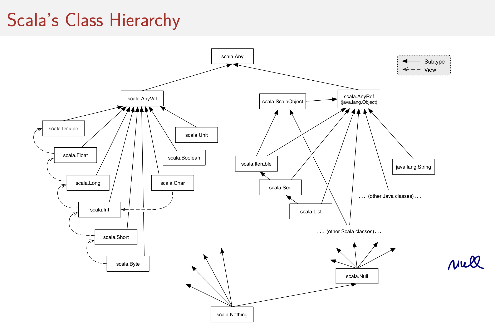
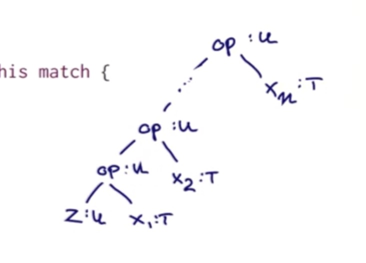
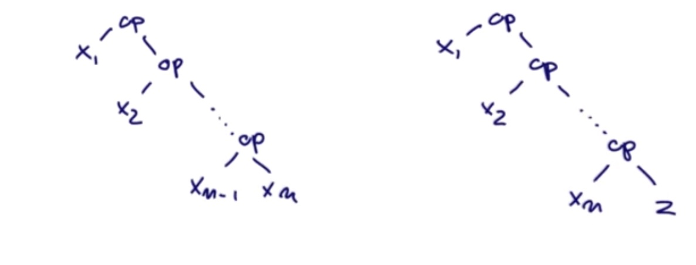

# fpp-in-scala

## Week1

### Lecture 1.1 - Programming Paradigms

functional Programming은 paradigm이다. classical imperative paradimg(Java or C)과 약간 다른.
scala에서는 이 2개의 paradigm을 합칠 수도 있다. 이는 다른 언어에서의 migration을 쉽게 해준다.

In science, a `paradigm` describes distinct concepts or thought patterns in some scientific discipline.

Main Programming Paradigms:
- imperative programming
- functional programming
- logic programming

object-oriented programming도 paradigm이라고 하는 사람들도 있지만 자신의 생각으로는 위 3개의 교차점에 있다고 생각한다.

#### Imperative Programming
- modifying mutable variables
- using assignments
- and control structures such as if-then-else, loops, break, continue, return

Von Neumann computer의 sequence를 이해하는 것은 imperative program을 이해하는 most common informal way이다.

> Processor <------BUS ------> Memory


Problem: Scaling up. How can we avoid conceptualizing programs word by word?

high-level abstractions(collections, polynomials, geomtric shapes, strings, documents..)를 정의하는 테크닉이 필요하다.

Ideally: Develop theories of collections, shapes, strings, ...

#### What is a theory
A theory consist of
- one or more data types
- operations on these types
- laws that describe the relationships between values and operations

보통 theory는 `mutations`를 describe하지 않는다!

mutation: identity는 유지하면서 something을 change하는 것이다.

##### Theories without mutations
theory of polynomials

> (a*x + b) + (c*x + d) = (a+c)*x + (b+d)

theory of strings

> (a ++ b) ++ c = a ++ (b ++ c)


#### Consequences for Programming
mathematical theroies를 따르면서 high-level concepts 구현을 하려면 mutation은 없어야 한다.
- theroies do not admit it
- mutation은 theories의 useful laws를 destoy 할 수 있다.

그러므로
- concentrate on defining theories for operators expressed as functions
- avoid mutations
- have powerful ways to abstract and compose functions

start of function programming means avoid mutations

#### Functional Programming
- In a restricted sense, FP means programming without mutable variables, assignments, loops, and other imperative control structures
- In a wider sense, FP meas focusing on the functions
- In particular, functions can be valuses that are produced, consumed, and composed
- All this becomes easier in a functional language

#### Functional Programming Language
- In a restricted sense, a functional programming language is one which does not have mutable variables, assignments, or imperative control structures.
- In a wider sense, a functional programming language enables the construction of elegant programs that focus on functions.
- In particular, functions in a FP language are first-class citizens. This means
    - they can be defined anywhere, including inside other functions
    - like any other value, they can be passed as parameters to functions and returned as results
    - as for other values, there exists a set operators to compose functions

#### Some functional programming languages
In the restricted sense:
- Pure Lisp, XSLT, XPath, XQuery, FP
- Haskell (without I/O Monad or UnsafePerformIO)

In the wider sense:
- Lisp, Scheme, Racket, Clojure ▶ SML, Ocaml, F#
- Haskell (full language)
- Scala
- Smalltalk, Ruby (!)

#### Why Functional Programming?
Functional Programming is becoming increasingly popular because it offers the following benfits.
- simpler reasoning principles
- better modularity
- good for exploiting parallelism for multicore and cloud computing.


#### my summary
우리는 수학을 배우면서 mutable variables를 배운 적이 없다.

1 + 1 = 2이고 a + b = 3 이라면 그냥 3인 것이다.
오늘은 a + b = 3 이었는데 내일은 a + b = 4일 순 없었다.
(ax^2 + bx + c 는 여러 값이 될 수 있겠지만)

하지만 imperative programming에서는 자연스러운 개념이다.
int a = 1;
int b = 2;
a + b = 3;

a = 4;
a + b = 6;

왜 수학적인 원칙을 꺼내 들었냐?
module화 때문이다.

프로그램이 복잡해지면서 모듈화는 필수이다.
잘 된 모듈화란 무엇일까? 항상 동일한 결과를 리턴하는 모듈일 것이다.

map 함수를 생각해보면 어느 타입에 상관없이
List[U]를 리턴한다.

이런 수학적 원칙들은 mutable variables를 인정하지 않는다. 그렇기에 functional programming language에 잘 맞는다.

fp는 이런 모호함을 제거함으로서 원칙을 보다 잘 구현하고 모듈화 하기 좋으며 multicore와 cloud computing 환경에서 병렬처리를 잘 할 수 있게 해준다.

<hr />

## substitution model
- 함수의 argument를 왼쪽부터 모두 평가
- 함수의 오른쪽부터 교체

-> 모든 Expression에 사용 가능 , No side effect

foundation of functional programming인 람다 calculus에 formalized 되어있다.

모든 Expr이 reduce to a value? (X)

아래와 같은 예가 있다.
```scala
def loop: Int = loop
```

### Evaluation Stratigies
CBV(Call By Value), CBN(Call By Name)
- CBV: 모든 args는 한 번만 평가한다는 장점
- CBN: 호출 될 때까지 not evaluted된다는 장점

만약 CBV가 종료된다면 CBN도 종료된다? (O)
반대로 CBN이 종료된다면 CBV도 종료된다? (X)

scala에서 CBN을 쓰는 방법은 parameter에 `=>`를 붙이면 된다.

```scala
def myFunc(a:=> Int) = a
```

### Value Definitions
```scala
val x = 2
val y = square(x) // 바로 평가된다.


def loop: Boolean = loop

def x = loop // (O) def는 호출될때 평가된다.
val x = loop // (X) Error

def and(x: Boolean, y: Boolean) =
  if (x) y else false

and(false, loop) // (X) Error

def and2(x: Boolean, y:=> Boolean) =
  if (x) y else false
and2(false, loop) // false
```

### Nested Functions
small func로 분리하는 것. good FP styles
sqrtIter, imporve 같은 함수들은 외부에 공개(direct 호출) 하고 싶지 않을 수 있다.

이러한 보조 함수들을 내부 함수로 둠으로써 name-space pollution을 방지할 수 있다.

```scala
def sqrt(x: Double) = {
  def improve
  def sqrtIter
}
```

### Lexical Scoping
outer block에 있는 definitions는 inside block에서 visible하다.

보통 문장 라인 끝 `;`는 optional이다.
다만 한 문장에 여러 expr을 표현할 때는 필수 이다.

```scala
val y = x + 1; y + y
```

### Tail Recursion
calls itself as its last action.
the function's stack frame can be reused
(one stack frame이 필요하며, tail calls 라고 함)

`@tailrec` annotation을 함수 위에 추가하면 해당 함수가 tail recur 하지 않을 시 오류가 발생한다.

아래의 factorial 함수는 tailrc 함수가 아니며 gcd는 tailrec 함수이다.

```scala
def gcd(a: Int, b: Int): Int =
  if (b == 0) a else gcd(b, a % b)

def factorial(n: Int): Int =
  if (n == 0) 1 else n * factorial(n - 1)
```

그 차이는 gcd는 스텝을 진행을 계속 하더라도 본인 호출만 계속 하게 되지만 factorial 같은 경우에는 좌측이 계속 늘어난다
> 4 * factorial(3)

이를 tail recursive 하게 변경하면 아래와 같다.

```scala
def factorial(n: Int): Int = {
  @tailrec
  def loop(acc: Int, n: Int): Int =
    if (n == 0) acc
    else loop(acc * n, n -1)
  loop(1, n)
}
```

Donal Knuth said premature optimization is the source of the evil

## Week2

### Higher order functions
pass functions as arguments and retun them as results.

functional languages treat functions as first-class values.
= like any other value, a function can be passed as a parameter and returned as a result.

provides a flexible way to compose program.


#### Anonymous Function
함수를 parameter로 전달하다보면 many small function을 만들게 된다. 그렇게 되면 각각의 naming을 정하는 것은 어렵게 된다.
=> anonymous function을 사용한다.

```scala
def str = "abc"; println(str)

println("abc")
```
위에는 str 변수를 정의해서 호출했고 아래는 정의 없이 사용 했다.
이것이 가능한 이유는 뭘까?
=> str은 literals 이기 때문이다.

마찬가지로 이름 없이 함수를 쓰면 function literals가 된다.
= anonymous functions

```scala
// cube anonymous func
(x: Int) => x * x * x
```
`(x: Int)`는 parameter
`x * x  * x`는 body


```scala
def sum(f: Int => Int, a: Int, b: Int): Int = {
  @tailrec
  def loop(a: Int, acc: Int): Int = {
    if (a > b) acc
    else loop(a + 1, f(a) + acc)
  }
  loop(a, 0)
}
def sumInts(a: Int, b: Int) = sum(x => x, a, b)

def sumCubes(a: Int, b: Int) = sum(x => x * x * x, a, b)
```

### Currying

아래 함수를 더 짧게 할 수는 없을까?
```scala
def sumInts(a: Int, b: Int) = sum(x => x, a, b)
```

```scala
def sum()
```

```scala
def sum(f: Int => Int)(a: Int, b: Int): Int =
  if (a > b) 0 else f(a) + sum(f)(a + 1, b)

def product(f: Int => Int)(a: Int, b: Int): Int =
  if (a > b) 1
  else f(a) * product(f)(a + 1, b)
```

위와 같은 스타일의 definition과 function을 currying이라고 부른다. Haskell Brooks Curry의 이름을 딴 네이밍이다.
Idea는 그 보다 전인 Schonfinkel과 Frege에 의해서 나왔지만 currying이란 네임으로 굳어졌다.


### Example: Finding Fixed Points
A number x is called a fixed point(고정 점) of a function f if

> f(x) = x

예로 f: x => 1 + x/2 라 할 때 fixed point는 2이다.
f(2) = 2이므로

몇몇 함수들은 f를 반복적으로 수행함으로서 fixed point를 찾을 수 있다.

> x, f(x), f(f(x)), f(f(f(x))), ...

initial estimate로 시작해서 f를 반복적으로 수행하다보면 더 이상 변하지 않는 값 혹은 변경이 충분히 적어졌을 때의 값을 fixed point라 부를 수 있다.

```scala
import math.abs

val tolerance = 0.0001
def isCloseEnough(x: Double, y: Double): Boolean =
  abs((x - y) / x) / x < tolerance

def fixedPoint(f: Double => Double)(firstGuess: Double) = {
  @tailrec
  def iterate(guess: Double): Double = {
    val next = f(guess)
    if (isCloseEnough(guess, next)) next
    else iterate(next)
  }
  iterate(firstGuess)
}
fixedPoint(x => 1 + x/2)(1) // 1.9975

def sqrt(x: Double) = fixedPoint(y => x / y)(1)
sqrt(2) // 무한 loop
```
위의 예에서 sqrt(2)를 수행하면 무한 loop가 발생한다.
1과 2 를 계속 반복한다
이를 해결 하기 위해서는 첫 번째 계산 값과 두 번째 계산 값의 평균을 구하면 된다.

```scala
def sqrt(x: Double) =
  fixedPoint(y => (y + x / y) / 2)(1)
```

#### functions as return values
위의 예제에서 평균을 통해 안정화시키는 기술은 추상화 될 수 있다.
```scala
def averageDamp(f: Double => Double)(x: Double) =
  (x + f(x)) / 2
def sqrt3(x: Double) =
  fixedPoint(averageDamp(y => x / y))(1)
```

Higher Order Function이 항상 옳은 것은 아니며 적절 할 때 사용해야 한다.


### Functions and Data
#### Classes
```scala
class Rational(x: Int, y: Int):
  def numer = x
  def denom = y
```
위 정의는 two entities를 생성한다.
- Rational 이라는 이름의 new type
- 이 type의 element를 만들기 위한 Rational constructo

스칼라는 types과 value의 names를 `different namespace`에 보관하기 때문에 충돌을 걱정할 필요 없다.

#### Objects
elements of a class type을 objects라고 부른다.
class 의 생성자를 calling 함으로서 object를 만들 수 있다.

```scala
Rational(1, 2)
```

아래와 같이 class내 member에 접근 가능하다

```scala
val x = Rational(1 ,2)
x.numer
x.denom
```

```scala
object rationals {
  val x = new Rational(1, 3)
  val y = new Rational(5, 7)
  val z = new Rational(3, 2)

  x.add(y).mul(z)
}
class Rational(x: Int, y: Int) {
  def numer = x
  def denom = y

  def add(r: Rational) =
    new Rational(numer * r.denom + r.numer * denom,
      denom * r.denom)

  def mul(r: Rational) =
    new Rational(numer * r.numer,
      denom * r.denom)

  def neg = new Rational(-numer, denom)

  def sub(r: Rational) = add(r.neg)

  override def toString = s"$numer/$denom"
}

```

### More Fun With Rationals
Client's view에서는 내부가 어떻게 동작하던지 동일하게 보인다.

without affecting client를 하면서 다른 구현을 선택하는 것을 `data abstraction`이라고 한다.
S/E에서의 cornerstone이다.

#### Self Reference
inside of a class, `this`는 현재 실행 중인 method내에서의 object를 의미한다

#### Preconditions
`require`로 class에 조건을 추가할 수 있다.
조건에 맞지 않으면 IllegalArgumentException이 발생하며 추가한 에러 메세지가 출력된다.

#### Assertions
require와 비슷한 의미이다.
require와 동일하게 condtion과 optional message string을 받는다.

```scala
val x = sqrt(y)
assert(x >= 0)
```

fail일 경우 assert는 require와 달리 AssertionError를 발생한다.

- require는 함수 호출자에게 precondition을 강요할 때 쓰인다
- assert는 함수 자신이 체크 할 때 사용한다.

#### Constructors
모든 class는 primary constructor(기본 생성자)가 암시적으로 있다.
- class의 모든 paramters를 받고
- class body의 모든 statement를 실행한다.

Java 같이 여러 생성자를 갖는 것도 가능하다.

```scala
object rationals {
  val x = new Rational(1, 3)
  val y = new Rational(5, 7)
  val z = new Rational(3, 2)

  x.add(y).mul(z)
  y.add(y)
  x.less(y)
  x.max(y)
  new Rational(2)
}
class Rational(x: Int, y: Int) {
  require(y != 0, "denominator must be nonezero")

  def this(x: Int) = this(x, 1) // 여기에서의 this는 constructor 의미로 쓰인다.

  private def gcd(a: Int, b: Int): Int = if (b == 0) a else gcd(b, a % b)
  private val g = gcd(x, y) // val로 선언했기에 바로 평가되서 다음 부턴 계산을 안하고 재사용한다.
  def numer = x / g
//    def numer = x / gcd(x,y) // 만약 이와 같이 선언 하면 매번 gcd를 계산해야 한다. 계산 리소스가 크고 가끔 호출될 때 사용하면 좋다.
  def denom = y / g

  def less(that: Rational) = numer * that.denom < that.numer * denom
  def max(that: Rational) = if (this.less(that)) that else this

  def add(r: Rational) =
    new Rational(numer * r.denom + r.numer * denom,
      denom * r.denom)

  def mul(r: Rational) =
    new Rational(numer * r.numer,
      denom * r.denom)

  def neg = new Rational(-numer, denom)

  def sub(r: Rational) = add(r.neg)

  override def toString = s"$numer/$denom"
}

```

<hr />

### Evaluation and Operators
#### Operators
##### Infix Notation
parameter를 갖는 모든 메소드는 infix operaotr처럼 사용할 수 있다.

r add s           r.add(s)
r less s          r.less(s)
r max s           r.max(s)

##### Relaxed Identifiers
operaotr는 identifier로 사용될 수 있다.
- 영문자: 문자로 시작하고, 뒤에는 문자 혹은 숫자가 올 수 있다.
- Symbolic: operator symbol로 시작해서, 다른 심볼이 뒤에 올 수 있다.
- `_` 문자는 문자로 카운트 된다
- 영문자 identifiers는 underscore로 끝날 수 있고 뒤에 다른 operator symbols가 붙을 수 있다.
* 만약 끝이 symbol들로 끝나면 뒤에 타입을 위한 `:` 과 한 칸 띄워야 한다.

examples
- x1
- *
- +?%&
- vector_++
- counter_=


-a 처럼 빼기가 아니라 마이너스 operator를 추가하고 싶다면 아래와 같이 해야 한다.
(`unary_` 가 앞에 붙어야 하고 `:`과 한칸 띄워 써야 한다.)
```scala
def unary_- : Rational = new Rational(-numer, denom)
```

#### Precedence Rules
연산자 우선순위.
첫 번째 문자에 따라 결정된다.
Java혹은 C와 차이 없다.

1번이 가장 낮은 순위이다.

1. (all letters)
2. |
3. ^
4. &
5. < >
6. = !
7. :
8. + -
9. * / %
10. (all other special values)


```scala
class Rational(x: Int, y: Int) {
  require(y != 0, "denominator must be nonezero")

  def this(x: Int) = this(x, 1) // 여기에서의 this는 constructor 의미로 쓰인다.

  private def gcd(a: Int, b: Int): Int = if (b == 0) a else gcd(b, a % b)
  private val g = gcd(x, y) // val로 선언했기에 바로 평가되서 다음 부턴 계산을 안하고 재사용한다.
  def numer = x / g
//    def numer = x / gcd(x,y) // 만약 이와 같이 선언 하면 매번 gcd를 계산해야 한다. 계산 리소스가 크고 가끔 호출될 때 사용하면 좋다.
  def denom = y / g

//    def less(that: Rational) = numer * that.denom < that.numer * denom
  def < (that: Rational) = numer * that.denom < that.numer * denom
  def max(that: Rational) = if (this.<(that)) that else this

  def +(r: Rational) =
    new Rational(numer * r.denom + r.numer * denom,
      denom * r.denom)

  def mul(r: Rational) =
    new Rational(numer * r.numer,
      denom * r.denom)

  def unary_- : Rational = new Rational(-numer, denom)

  def -(that: Rational) = this + -that

  override def toString = s"$numer/$denom"
}
```


## Week3

### Class Hierarchies
실제 메소드는 runtime type에 의존한다. 이를 dynamic binding이라고 한다.
이는 OOP에 기본 요소이다.

아래 함수는 abstract class이다.
```scala
abstract class IntSet {
  def incl(x: Int): IntSet
  def contains(x: Int): Boolean
}
```
추상 클래스는
- 구현체가 없는 멤버를 포함할 수 있다.
- new operator를 사용한 인스턴스 생성을 할 수 없다.

```scala
abstract class IntSet {
  def incl(x: Int): IntSet
  def contains(x: Int): Boolean
}

class NonEmpty(elem: Int, left: IntSet, right: IntSet) extends IntSet {
  override def incl(x: Int): IntSet =
    if (x < elem) new NonEmpty(elem, left incl x, right)
    else if (x > elem) new NonEmpty(elem, left, right incl x)
    else this

  override def contains(x: Int): Boolean =
    if (x < elem) left contains x
    else if (x > elem) right contains x
    else true

  override def toString = "{" + left + elem + right + "}"
}

class Empty extends IntSet {
  override def incl(x: Int) = new NonEmpty(x, new Empty, new Empty)

  override def contains(x: Int) = false
  override def toString = "."
}


val t1 = new NonEmpty(3, new Empty, new Empty)
val t2 = t1 incl 4
```

위의 예에서 IntSet은 Empty와 NonEmpty의 superclass이다.
Empty와 NonEmpty는 IntSet의 subclasses이다.
스칼라에서 superclass가 없으면 java.lang에 있는 Java standard class Object 를 상속 받는다.
클래스의 direct or indirect superclass를 base classes라고 한다.
NonEmpty와 IntSet의 base classes는 Object이다.

non-abstract definition을 redfine할 때는 override keyword를 써줘야 한다.
```scala
abstract class Base {
  def foo = 1
  def bar: Int
}

class Sub extends Base {
  override def foo = 2
  def bar = 3
}
```

### Object Definitions
위의 예에서 유저가 많은 EmptySet을 만들게 되면 문제가 발생한다.
그래서 이를 object로 선언하는 것이 낫다.

```scala
object Empty extends IntSet {
  def incl(x: Int) = new NonEmpty(x, new Empty, new Empty)
  def contains(x: Int) = false
}
```
이렇게 하면 Empty라는 이름의 singleton object가 만들어 진다.
이로써 다른 Empty 인스턴스는 만들어질 수 없다.
Singleton Object는 values 이므로, Empty는 바로 평가된다.


### Programs
Scala에서 standalone application을 만드는 것은 가능하다.
main method를 포함하는 object를 만들면 된다.

```scala
object Hello {
  def main(args: Array[String]) = println("hello world!")
}
```
프로그램이 컴파일 되고 나면 아래의 커맨드로 실행할 수 있다.
```bash
> scala Hello
```

### Dynamic Binding
code invoked by a method call depends on the runtime of the object that contains the method

ex)
```scala
Empty contains 1
```
-> false

### Lecture 3.2 - How Classes Are Organized
#### Packages
Classes와 objects는 package안에 구성된다된

package에 속하는 class, object는 소스 파일의 최상단에 package를 써야 한다.
```scala
package progfun.examples

object Hello { ... }
```
아래와 같이 프로그램을 실행할 수 있다.
```bash
> scala progfun.examples.Hello
```

#### Forms of Imports
```scala
import week3.Rational // named imports
import week3.{Rational, Hello} // named imports
import week3._ // wildcard import
```

#### Automatic Imports
- All members of package scala
- All members of package java.lang
- All members of the singleton object scala.Predef


Int: scala.Int
Boolean: scala.Boolean
Object : java.lang.Object
require: scala.Predef.require
assert: scala.Predef.assert

#### Traits
Java 처럼 Scala는 오직 하나의 superclass를 가질 수 있다.(Single Inheritance)
하지만 여러개의 supertypes를 갖고 싶다면 어떻게 할까?
traits를 사용하면 된다.
trait은 abstract class처럼 정의 하면서 trait 키워드를 쓰면 된다를
```scala
trait Planar {
  def height: Int
  def width: Int
  def surface = height * width
}
```

```scala
class Square extends Shape with Planar with Movable ...
```
trait은 Java의 interface와 비슷하지만 더 강력하다.
fields와 concrete methods(정의된 메소드)를 가질 수 있기 때문이다.

하지만 trait은 (value) parameters를 가질 수 없다. 이는 클래스만 가능하다.



#### Top Types
Any: The base type of all types. Methods: '==', '!=', 'equals', 'hashCode', 'toString
AnyRef: The base type of all reference types; Alias of 'java.lang.Object'
AnyVal: The base type of all primitive types

#### The Nothing Type
Nothing은 Scala type hierarchy에서 최 하단에 있다.
type Nothing에는 value가 없다.
왜 쓰일까?
- To signal abnormal termination
- As an element type of empty collection

#### Exceptions
자바와 유사하다
```scala
throw Exc
```
이 expr의 type은 Nothing이다.

example
```scala
def error(msg: String) = throw new Error(msg)

error("test")
```

#### The Null Type
every reference class type은 null 값을 갖는다.
null의 타입은 Null 이다.
Null은 Object를 상속받는 모든 클래스의 subtype이다.
하지만 AnyVal의 subtypes과는 incompativle 하다.

```scala
val x = null // x: Null
val y: String = null // y: String
val z: Int = null // error: type mismatch
```

### Lecture 3.3 - Polymorphism

#### Type Parameter
여러 타입에 대응할 수 있는 타입이다.

```scala
trait List[T]
class Cons[T](val head: T, val tail: List[T]) extends List[T]
class Nil[T] extends List[T]
```
타입 파라미터는 square brackets 안에 쓰인다.

#### Generic Functions
classes처럼 function에도 type parameter를 사용할 수 있다.
```scala
def singleton[T](elem: T) = new Cons[T](elem, new Nil[T])

singleton[Int](1)
singleton[Boolean](true)
```

#### Type Inference
스칼라는 function call의 arguments로 부터 parameter의 옳은 타입을 추측할 수 있다.
그렇기에 대부분의 경우에서 type parameters는 안써도 된다.

```scala
singleton(1)
singleton(true)
```

#### Type Evaluation
스칼라에서 Type parameter는 evaluation에 영향을 끼치지 않는다.
모든 type parameters와 type arguments는 프로그램을 평가하기 전에 제거된다.
이를 `type erasure`라고 부른다.

Java, Scala, Haskell, ML, OCaml에서는 type erasure를 사용한다.
하지만 C++, C#, F# 같은 언어는 run time시에도 type parameter를 유지한다.

#### Polymorphism
function type comes "in many forms"
- function이 여러 타입의 argument에 적용될 수 있다
- 타입이 여러 타입의 인스턴스를 가질 수 있다.

폴리몰피즘의 두 가지 형태
- subtyping: instances of subclass 는 base class로 전달 될 수 있다.
- generic: function 혹은 클래스의 instance는 type paramterization으로 만들 수 있다.

## Week4

### Lecture 4.1 - Objects Everywhere
#### Pure Object Orientation
A pure object-oriented language is one in which every value is an object

스칼라는 pure object-oriented language인가?

#### Standard Classes
스칼라에서 Int 혹은 Boolean 같은 타입들은 특별취급을 받지 않는다.
다른 클래스들과 마찬가지로 scala 패키지 안에 정의된 것이다.

#### Pure Booleans
Boolean type은 JVM의 primitive type boolean이다.
하지만 이를 클래스로도 정의할 수 있다.

```scala
package idealized.scala
abstract class Boolean {
  def ifThenElse[T](t: => T, e: => T): T

  def && (x: => Boolean): Boolean = ifThenElse(x, false)
  def || (x: => Boolean): Boolean = ifThenElse(true, x)
  def unary_!: Boolean            = ifThenElse(x, false)

  def == (x: Boolean): Boolean    = ifThenElse(x, x.unary_!)
  def !& (x: Boolean): Boolean    = ifThenElse(x.unary_!, x)
  ...
}

object true extends Boolean {
  def ifThenElse[T](t: => T, e: => T) = t
}

object false extends Boolean {
  def ifThenElse[T](t: => T, e: => T) = e
}
```


### Lecture 4.2 - Functions as Objects
function values는 object로 취급된다.

function type A => B는 class scala.Function1[A,B]의 축약이다.

```scala
package scala
trait Function1[A, B] {
  def apply(x: A): B
}
```
그러므로 functions는 objects이다 apply methods를 갖는.

`(x: Int) => x * x`는 아래와 같이 확장된다.

```scala
{
  class AnonFun extends Function1[Int, Int] {
    def apply(x: Int) = x * x
  }
  new AnnonFun
}
```
또는
```scala
new Function1[Int, Int] {
  def apply(x: Int) = x * x
}
```

#### Expansion of Function Calls
f(a, b)는 아래와 같이 확장된다.
`f.apply(a, b)`

```scala
val f = (x: Int) => x * x
f(7)
```
은 아래와 같이 확장된다.
```scala
val f = new Function1[Int, Int] {
  def apply(x: Int) => x * x
}
f.apply(7)
```

#### Functions and Methods
아래와 같은 메소드는 그 자체로는 function value가 아니다.
```scala
def f(x: Int): Boolean = ...
```
하지만 f는 Function type이 기대되는 곳에서 사용되기 때문에 자동적으로 function value로 변환된다.
```scala
(x: Int) => f(x)
```

### Lecture 4.3 - Subtyping and Generics
Type Bounds

만약 `assertAllPos`라는 method가 있다고 하자.

- IntSet을 받고
- 만약 모든 엘리먼트가 positive라면 IntSet을 리턴한다.
- 그 외에는 exception을 던진다.

`def assertAllPos(s: IntSet): IntSet`
이 코드는 모든 경우를 포함하지 않는다.
nonEmpty를 파라미터로 준다면 NonEmpty 혹은 Error가 반환되고 Empty를 파라미터로 보내면 Empty가 반환되기 떄문이다.
정확한 IntSet이 아닌 상속 Empty와 NonEmpty는 하위 클래스이다.

```scala
def assertAllPos[S <: IntSet](r: S): S
```
여기에서 `<: IntSet`은 type parameter S의 `upper bound`이다.

- S <: T means: S는 T의 subtype이다
- S >: T means: S는 T의 supertype이다. 또는 T는 S의 subtype이다.

`[S >: NonEmpty]` 일때
S는 NonEmpty, IntSet, AnyRef, Any가 될 수 있다.

이 두개를 섞는 것도 가능하다

`[S >: NonEmpty <: IntSet]`

#### Covariance
subtyping과 type parameter를 사용할 때 고려해야할 사항이 있다.

`NonEmpty <: IntSet` 일때

`List[NonEmpty] <: List[IntSet]` 인가?
우리는 이런 것을 공변(covariant)라고 부른다.

Java에선 되지만 스칼라에선 안된다.

아래와 같은 Java Code를 보자
```java
NonEmpty[] a = new NonEmpty[]{new NonEmpty(1, Empty, Empty)}
IntSet[] b = a
b[0] = Empty
NonEmpty s = a[0]
```
3번 째 라인에서 runtime error(ArrayStoreException)가 발생한다.
NonEmpty에 Empty를 넣으려고 시도하기 때문이다.

그렇기 때문에 Scala에선 List Convariance가 안된다.

```scala
val a: Array[NonEmpty] = Array(new NonEmpty(1, Empty, Empty))
val b: Array[IntSet] = a
b(0) = Empty
val s: NonEmpty = a(0)
```
위에서 2번쨰 라인에서가 error가 발생한다.
Scala에선 List Convariance가 안되기 때문이다.

### Lecture 4.5 - Decomposition

#### Decomposition
예를들어 수학 연산을 위한 작은 인터프리터를 만든다고 하자.
간단하게 하기 위해 numbers와 additions만 한다.
Expressions는 class hierarchy로 표현될 수 있고
기본 trait인 Expr과 two subclasses인 Number와 Sum으로 구성할 수 있다.

```scala
trait Expr {
  def isNumber: Boolean
  def isSum: Boolean
  def numValue: Int
  def leftOp: Expr
  def rightOp: Expr
}
class Number(n: Int) extends Expr {
  def isNumber: Boolean = true
  def isSum: Boolean = false
  def numValue: Int = n
  def leftOp: Expr = throw new Error("Number.leftOp")
  def rightOp: Expr = throw new Error("Number.rightOp")
}
class Sum(e1: Expr, e2: Expr) extends Expr {
  def isNumber: Boolean = false
  def isSum: Boolean = true
  def numValue: Int = throw new Error("Sum.numValue")
  def leftOp: Expr = e1
  def rightOp: Expr = e2
}

def eval(e: Expr): Int = {
  if (e.isNumber) e.numValue
  else if (e. isSum) eval(e.leftOp) + eval(e.rightOp)
  else throw new Error("Unknown expression" + e)
}
```

만약 Expr에 새로운 메서드를 추가한다고 가정하면 이를 확장하는 class들에도 모두 구현을 추가해야 한다.
새로운 클래스를 추가할수록 계속해서 많은 메서드를 추가해야 한다.

#### Non-Solution: Type Tests and Type Casts
```scala
def isInstanceOf[T]: Boolean // check whether this object's type conforms to 'T'
def asInstanceOf[T]: T       // treat this object as an instance of type 'T'
                             // throws 'ClassCastException' if it isn't
```

```scala
def eval(e: Expr): Int =
  if (e.isInstanceOf[Number])
    e.asInstanceOf[Number].numValue
  else if (e.isInstanceOf[Sum])
    eval(e.asInstanceOf[Sum].leftOp) +
    eval(e.asInstanceOf[Sum].rightOp)
  else throw new Error("Unknown expression " + e)
```
no need for classification methods, access 메소드를 필요할 때만 사용할 수 있다는 장점이 있다.
low-level, potentially unsafe하다는 단점이 있다.

type cast를 수행했을 때 오류가 발생하는 것을 runtime에서 알 수 있다.

#### Solution1: Object-Oriented Decomposition
```scala
trait Expr {
  def eval: Int
}
class Number(n: Int) extends Expr {
  def eval: Int = n
}
class Sum(e1: Expr, e2: Expr) extends Expr {
  def eval: Int = e1.eval + e2.eval
```
만약 새로운 메소드가 추가된다면 모든 클래스 hierarchy에 있는 클래스에 메소드를 추가해야 한다.


### Lecture 4.6 - Pattern Matching
good fit for the problem of decomposition

#### Case Classes
case classes 의 정의는 일반 class 정의와 비슷하다. 앞에 case를 붙이는 것 빼고
```scala
trait Expr
case class Number(n: Int) extends Expr
case class Sum(e1: Expr, e2: Expr) extends Expr
```
위와 같이 하면 자동적으로 object와 apply methods가 생성된다.

```scala
object Number {
  def apply(n: Int) = new Number(n)
}
object Sum {
  def apply(e1: Expr, e2: Expr) = new Sum(e1, e2)
}
```
object로 만들어졌기 때문에 new Number(1) 대신 Number(1)로서 사용할 수 있다.


#### Pattern Matching
클래스 구조에서 C와 Java의 switch 의 generalization이다.

```scala
def eval(e: Expr): Int = e match {
  case Number(n) => n
  case Sum(e1, e2) => eval(e1) + eval(e2)
}
```
만약 일치하는 패턴이 없다면 MatchError가 발생한다.

Pattern이 될 수 있는 것은 아래와 같다.
- constructors, eg. Number, Sum
- variables, e.g. n, e1, e2
- wildcard patterns _,
- constants, e.g. 1, true.

참고로 아래와 같은 제약 사항이 있다.
variables는 반드시 소문자로 시작해야 하며
pattern안에 변수명은 한 번만 쓰여야 한다. 예로 Sum(x, x)는 안된다.
constants의 names은 대문자로 시작해야 한다.


### Lecture 4.7 - Lists
```scala
val fruit = List("apples", "oranges", "pears")
val nums = List(1,2,3,4)
val diag3 = List(List(1, 0, 0))
val empty = List()
```

List와 Array는 중요한 차이가 있다.
- List는 immutable 하다. -> element of a list cannot be changed
- List는 recursive 하다. 반면 Array는 flat하다.

#### The List Type
array같이 lists는 homogeneous하다. (list의 모든 element가 동일한 타입이어야 한다)

```scala
val fruit: List[String] = List("apples", "oranges", "pears")
val nums: List[Int] = List(1,2,3,4)
val diag3: List[List[Int]] = List(List(1, 0, 0))
val empty: List[Nothing] = List()
```

#### Constructors of Lists
- empty list Nil
- operation `::` (pronounced cons)
    - `x :: xs` 는 첫 번째 element가 x이고 그 뒤로 xs가 오는 새로운 list를 생성한다.

```scala
fruit = "apples" :: ("oranged" :: ("pears" :: Nil))
nums = 1 :: (2 :: (3 :: (4 :: Nil)))
empty = Nil
```

A :: B :: C는 A :: (B :: C)로 인터프리트 된다.


```scala
val nums = 1 :: 2 :: 3 :: 4 :: Nil

// 위 표현과 같은 의미로 다르게 쓸 수 있다.
Nil.::(4).::(3).::(2).::(1)
```

#### Operations on Lists

head
tail
isEmpty

#### List Patterns
Nil                   -> The Nil constant
p :: ps               -> head가 p이고 나머지가 ps에 매칭
List(p1, ... , pn)    -> same as p1 :: ... :: pn :: Nil

- examples

1 :: 2 :: xs    1과 2로 시작하는 list
x :: Nil        length가 1인 List
List (x)        x :: Nil과 동일
List()          empty list, Nil과 동일
List(2 :: xs)   2로 시작하는 리스트를 포함하는 리스트


#### Sorting Lists
- Insertion Sort
List(7,3,9,2)가 있을 때 tail List인 List(3,9,2)를 sort해서 (2, 3, 9)를 얻고 7을 적절한 위치에 배치해 (2, 3, 7, 9)를 만든다.

```scala
def isort(xs: List[Int]): List[Int] = xs match {
  case List() => List()
  case y :: ys => insert(y, isort(ys))
}
```


## Week5
### Lecture 5.1 - More Functions on Lists

#### List Methods(1)

xs.length
xs.last    -> xs가 empty라면 Error
xs.init    -> last를 제외한 나머지 리스트. xs가 empty라면 Error
xs take n  -> xs 리스트 내 맨 앞부터 n개를 취한 리스트. 또는 n이 xs 길이 보다 크다면 xs 자체를 리턴
xs drop n  -> xs 리스트 내 맨 앞부터 n 개를 버린 뒤의 리스트
xs(n)

#### List Methods(1)
- Creating new Lists:
xs ++ ys           -> xs 리스트 뒤에 ys를 합친 리스트
xs.reverse
xs updated (n, x)  -> n번째 index에는 x를 넣고 나머지는 xs인 리스트

- Finding elements:
xs indxOf x    -> xs 리스트내 x와 같은 첫 번째 element의 index. 없다면 -1 리턴
xs contains x  -> same as `xs indexOf x >= 0`

#### Implementations
```scala
def last[T](xs: List[T]): T = xs match {
  case List() => throw new Error("last of empty list")
  case List(x) => x
  case y :: ys => last(ys)
}
```

```scala
def init[T](xs: List[T]): List[T] = xs match {
  case List() => throw new Error("init of empty list")
  case List(x) => List()
  case y :: ys => y :: init(ys)
}
```

```scala
def concat[T](xs: List[T],  ys: List[T]): = xs match {
  case List() => ys
  case z :: zs => z :: concat(zs, ys)
}
```

```scala
def reverse[T](xs: List[T]): List[T] = xs match {
  case List() => List()
  case y :: ys => reverse(ys) ++ List(y) // ++ 는 concatenation이다.
}
```
위의 reverse함수는 concat할때 n, reverse할 때 n
n * n 의 복잡도를 갖는다.

```scala
def removeAt(n: Int, xs: List[Int]) = (xs take n) ::: (xs drop n + 1)
```


### Lecture 5.2 - Pairs and Tuples
insertion sort보다 좋은 알고리즘인 merge sort를 구현해보자.

만약 리스트가 비어있거나 한 개의 엘리먼트가 있다면 이미 소팅된 것이다.
그렇지 않다면
- 리스트를 절반으로 나누어 두 개의 서브 리스트를 만든다.
- 서브 리스트를 sort 한다
- 두 개의 sort된 sub lists를 합친다.


#### SplitAt Function
returns two sublists

- 주어진 index로 부터의 앞 요소들
- 주어진 index로 부터의 뒤 요소들
lists가 `pair`로 리턴된다.

#### Detour: Pair and Tuples
x,y pair는 `(x, y)` 로 표현한다.

```scala
val pair = ("answer", 42)

val (label, value) = pair
```

#### The Tuple class
모든 Tuple n 클래스는 다음과 같은 패턴으로 모델 된다.

```scala
case class Tuple2[T1, T2](_1: +T1, _2: +T2) {
  override def toString = "(" + _1 + "," + _2 + ")"
}
```

아래는 pattern binding
`val (label, value) = pair`

대신 아래와 같이 쓸 수 있다.
```scala
val label = pair._1
val value = pair._2
```

하지만 패턴 매칭 폼이 일반적으로 선호된다.

```scala
def msort(xs: List[Int]): List[Int] = {
  val n = xs.length / 2
  if (n == 0) xs
  else {
    def merge(xs: List[Int], ys: List[Int]): List[Int] = (xs, ys) match {
      case (Nil, ys) => ys
      case (xs, Nil) => xs
      case (x :: xs1, y :: ys1) =>
        if (x < y) x :: merge (xs1, ys)
        else y :: merge(xs, ys1)
    }
    val (fst, snd) = xs splitAt n
    merge(msort(fst), msort(snd))
  }
}
val nums = List(2, -4, 5, 7, 1)
msort(nums)
```


### Lecture 5.3 - Implicit Parameters
#### Making Sort more General
msort를 모든 타입에 대해서 구현해보자

```scala
def msort[T](xs: List[T]): List[T] = ???
```
이전에 구현했던 코드를 그대로 바꾼다고 하면 동작하지 않는다.
`<` 가 모든 타입 T에서 정의되지 않았기 때문이다.
=> 비교 함수가 필요하다.

#### Parametrization with Ordered
Ordering을 위한 standard library가 있다.
`scala.math.Ordering[T]`
이를 이용하면 아래와 같이 가능하다.

```scala
import math.Ordering
def msort[T](xs: List[T])(ord: Ordering[T]): List[T] = {
  val n = xs.length / 2
  if (n == 0) xs
  else {
    def merge(xs: List[T], ys: List[T]): List[T] = (xs, ys) match {
      case (Nil, ys) => ys
      case (xs, Nil) => xs
      case (x :: xs1, y :: ys1) =>
        if (ord.lt(x, y)) x :: merge (xs1, ys)
        else y :: merge(xs, ys1)
    }
    val (fst, snd) = xs splitAt n
    merge(msort(fst)(ord), msort(snd)(ord))
  }
}

val nums = List(2, -4, 5, 7, 1)
// x와 y에 타입을 지정 안해도 scala compiler가 Int를 인지 한다.
msort(nums)(Ordering.Int)

val fruits = List("apple", "pineapple", "orange", "banana")
// compareTo는 JAVA String 메서드이다.
// first string 이 second string 보다 작으면 -1 같으면 0 크면 1을 리턴한다.
msort(fruits)(Ordering.String)
```

#### Aside: Implicit Parameters
passing lt or ord values는 거추장스럽다.
implicit paramter로 이를 피할 수 있다.

```scala
import math.Ordering
def msort[T](xs: List[T])(implicit ord: Ordering[T]): List[T] = {
  val n = xs.length / 2
  if (n == 0) xs
  else {
    def merge(xs: List[T], ys: List[T]): List[T] = (xs, ys) match {
      case (Nil, ys) => ys
      case (xs, Nil) => xs
      case (x :: xs1, y :: ys1) =>
        if (ord.lt(x, y)) x :: merge (xs1, ys)
        else y :: merge(xs, ys1)
    }
    val (fst, snd) = xs splitAt n
    merge(msort(fst), msort(snd))
  }
}

val nums = List(2, -4, 5, 7, 1)
// x와 y에 타입을 지정 안해도 scala compiler가 Int를 인지 한다.
msort(nums)

val fruits = List("apple", "pineapple", "orange", "banana")
// compareTo는 JAVA String 메서드이다.
// first string 이 second string 보다 작으면 -1 같으면 0 크면 1을 리턴한다.
msort(fruits)
```
위와 같이 implicit을 선언해주면 타입을 안넘겨줘도 컴파일러가 해결해준다.

#### Rules for Implicit Parameters
function이 type T에 대한 implicit arguments를 받는 다면 아래와 같이 implicit definition을 찾는다.
- is marked implicit
- has a type compatible with T
- is visible at the point of the function call, or is defined in a companion object associated with T

만약 이 중에 가장 구체적인 하나의 정의가 있다면 이를 적용한다.
그 외의 모든 경우는 에러를 발생시킨다.


### Lecture 5.4 - Higher-Order List Functions
lists의 모든 함수들은 first order이다.
그 말은 functions들이 primitive type의 lists를 arguments로 받고 그들을 결과로서 리턴한다는 것이다.

여기에서는 다른 함수를 arguments로 받는 higher-order list functions를 구현해본다.

#### Map
map의 실제 구현은 아래 보다 복잡하다.
실제 코드는 tail-recusrive 하고, 모든 collection에 대해 적용 가능하기 때문이다.

```scala
abstract class List[T] {
  def map[U](f: T => U): List[U] = this match {
    case Nil => this
    case x :: xs => f(x) :: xs.map(f)
  }
}
```
이를 이용한 함수는 아래와 같다.
```scala
def scalaList(xs: List[Double], factor: Double) =
  xs map (x => x * factor)
```

#### Filtering
또 다른 common operation on lists에는 주어진 조건에 맞는 elements만 select하는 filtering이 있다.

```scala
def filter(p: T => Boolean): List[T] = this match {
  case Nil => this
  case x :: xs => if(p(x)) x :: xs.filter(p) else xs.filter(p)
}
```

```scala
// filter 사용 안 한 버전
def posElems(xs: List[Int]): List[Int] = xs match {
  case Nil => xs
  case y :: ys => if (y > 0) y :: posElems(ys) else posElems(ys)
}

// filter 사용 버전
def posElems(xs: List[Int]): List[Int] =
  xs filter (x => x > 0)
```

#### Variations of Filter
```scala
xs filterNot p // same as filter(x => !p(x))

xs partition p // same as (xs filter p, xs filterNot p)

xs takeWhile p //  p를 만족하는 모든 elements들의 longest prefix of list xs

xs dropWhile p // 첫 요소 부터 p를 만족하는 elements를 모두 제외하고 불만족 된 element 부터 마지막까지의 list

xs span p // same as (xs takeWhile p, xs dropWhile p)
```

```scala
val nums = List(2, -4, 5, 7, 1)
val fruits = List("apple", "pineapple", "orange", "banana")

nums filter (x => x > 0)
nums filterNot (x => x > 0)
nums partition (x => x > 0)

nums takeWhile (x => x > 0) // 2
nums dropWhile (x => x > 0) // -4, 5, 7, 1
nums span (x => x > 0) // (List(2), List(-4, 5, 7, 1))

val data = List("a", "a", "a" , "b", "c" , "c", "a")
def pack[T](xs: List[T]): List[List[T]] = xs match {
  case Nil => Nil
  case x :: xs1 =>
    val (first, rest) = xs span(y => y == x)
    first :: pack(rest)
}
pack(data) // List(List(a,a,a), List(b)...

def encode[T](xs: List[T]): List[(T, Int)] =
  pack(xs) map (ys => (ys.head, ys.length))

encode(data) // List((a, 3), (b, 1), (c, 2), (a, 1))
```


### Lecture 5.5 - Reduction of Lists
이번에는 저번에 이어 hof를 배우는데 fold or reduce combiators라 불리는 함수들을 배울 것이다.

#### ReduceLeft
```scala
def sum(xs: List[Int]): Int = xs match {
  case Nil => 0
  case y :: ys => y + sum(ys)
}
```
위 와 같은 메서드는 redceLeft로 abstract 가능하다.
reduceLeft는 given binary operator를 list의 adjacent elements 사이에 insert하는 것이다.

> List(x1, ..., xn) reduceLeft op = (... (x1 op x2) op ... ) op xn

reduceLeft를 사용하면 아래와 같이 가능하다

```scala
def sum(xs: List[Int]) = (0 :: xs) reduceLeft ((x, y) => x + y)
def product(xs: List[Int]) = (1 :: xs) reduceLeft ((x, y) => x * y)
```

#### A Shorter Way To Write Functions
((x, y) => x * y) 대신 아래와 같이 쓸 수 있다.

```scala
(_ * _)
```
모든 `_` 는 new parameter를 나타낸다. 왼쪽부터 오른쪽으로
이 parameter는 next outer pair of parentheses까지 유효하다.

```scala
def sum(xs: List[Int]) = (0 :: xs) reduceLeft (_ + _)
def product(xs: List[Int]) = (1 :: xs) reduceLeft (_ * _)
```

#### FoldLeft
reduceLeft의 더 general 한 function이 있는데 이를 foldLeft라고 한다.

reduceLeft와 비슷하지만 additional parameter로서 `accumulator` z 를 받는다.
empty list일 경우 z를 리턴한다.

```scala
def sum(xs: List[Int]) = (xs foldLeft 0) (_ + _)
def product(xs: List[Int]) = (xs foldLeft 1) (_ * _)
```

#### Implementations of ReduceLeft and FoldLeft
```scala
abstract class List[T] { ...
  def reduceLeft(op: (T, T) => T): T = this match {
    case Nil => throw new Error("Nil.reduceLeft")
    case x :: xs => (xs foldLeft x)(op)
  }
  def foldLeft[U](z: U)(op: (U, T) => U): U = this match {
    case Nil => z
    case x :: xs => (xs foldLeft op(z, x))(op)
  }
}
```


### FoldRight and ReduceRight
foldLeft와 reduceLeft는 unfold on tress that lean to the left 를 한다.

반대로 FoldRight와 ReduceRight는 produce trees which lean to the right 한다.

List(x1, ..., x{n-1}, xn) reduceRight op = x1 op ( ... (x{n-1} op xn) ... )
(List(x1, ..., xn) foldRight acc)(op)    = x1 op ( ... (xn op acc) ... )




```scala
abstract class List[T] { ...
  def reduceRight(op: (T, T) => T): T = this match {
    case Nil => throw new Error("Nil.reduceLeft")
    case x :: xs => op(x, xs.reduceRight(op))
  }
  def foldRight[U](z: U)(op: (U, T) => U): U = this match {
    case Nil => z
    case x :: xs => op(x, (xs foldRight z)(op))
  }
}
```

#### Difference between FoldLeft and FoldRight
produce different tree
Left leaning trees, Right leaning trees

둘 이 동일한 결과를 만들어 낼 수도 있지만(효율성에선 차이가 있을 수 있다) 때때로는 한 가지만 적용 가능하다.

```scala
def concat[T](xs: List[T], ys: List[T]): List[T] =
  (xs foldRight ys) (_ :: _)
```
위의 함수에서 foldLeft는 안된다. 왜냐?!
`::` 연산자에 paramter 타입 T가 올 수 없기 때문이다. List만 전달해야 한다.
(그림을 그려보면 foldLeft의 오른쪽엔 T값들이 온다.)


### Lecture 5.6 - Reasoning About Concat
### Lecture 5.7 - A Larger Equational Proof on Lists